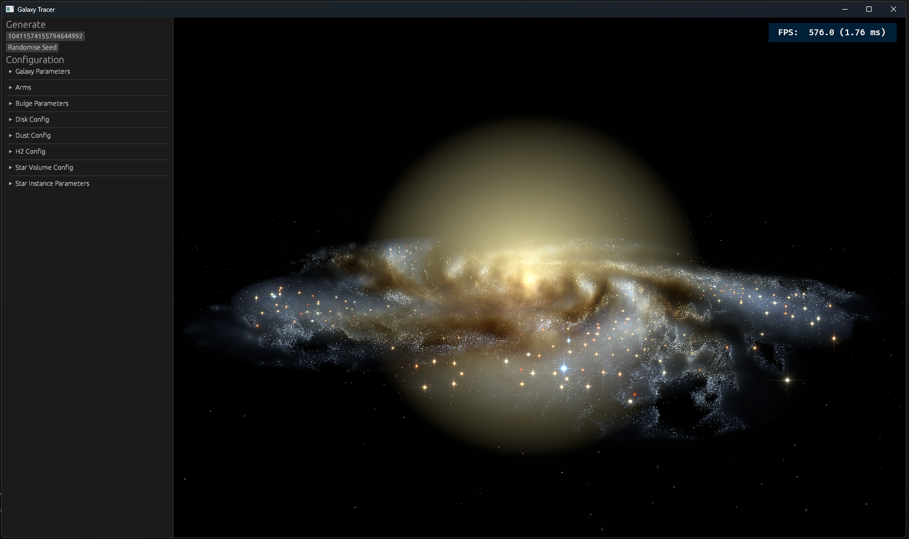
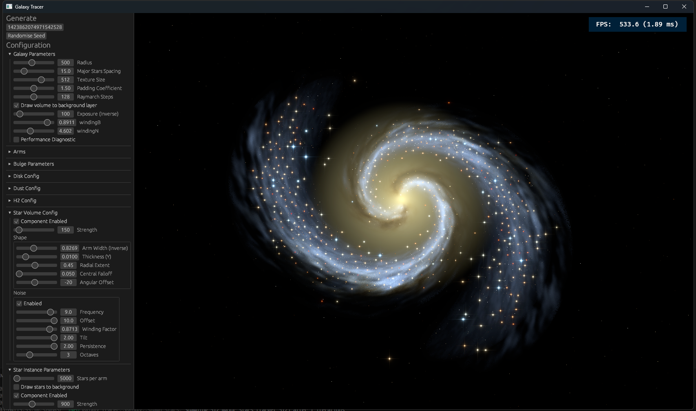
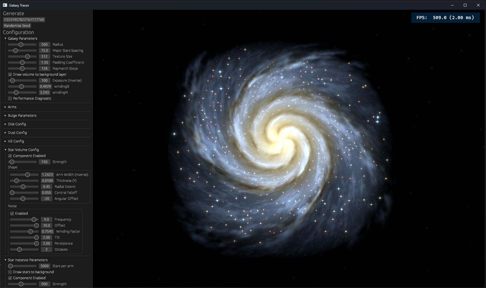

## Volumetric Galaxy Tracer

Generates and renders 3D galaxies. Uses the Bevy Engine.

Based on the following paper

> Groeneboom, N.E. and Dahle, H., 2014. Introducing GAMER: a fast and accurate method for ray-tracing galaxies using procedural noise. The Astrophysical Journal, 783(2), p.138.

My implementation runs primarily on the GPU, allowing the originally offline algorithm to render at <7ms per frame.

To optimise the algorithm for real-time performance, I precompute as much as possible and save to textures which can be sampled and interpolated during the volumetric raymarching.
Precomputing the full 3D density function would be inefficient and cost excessive memory. However, this is not necessary because the function can easily be decomposed into independent functions (a 2D galaxy shape function, 1D altitude function, and a 3D noise function).
The 2D and 1D functions are easy to deal with as it's just a matter of precomputing a mid-size 2D texture and a tiny 1D LUT.
Noise is a bit harder as it still needs to be a 3d function. There are 2 viable approaches
 * Precompute tiling 3D noise texture (best performance)
 * Evaluate a noise function at runtime (best quality)
I experimented with both, but settled on the runtime noise because it is much higher quality than I could achieved with the precomputed noise, and I was still able to achieve adequate performance. Even if the noise is evaluated at runtime, there are still solid gains from precomputing the other parts of the function as they are also quite expensive.
I do think there is still a possibility to achieve visually satisfactory results with very careful use of layered tiling noise, this would be worth exploring further if adapting this technique to a game where the cost absolutely matters.

To improve real-time performance, the volumetric render is performed at quarter resolution and temporally reprojected and accumulated.

I also experimented with using billboards to efficiently add bright stars to the visualisation. This component is based on Fabrice Neyret's PSF approximation https://www.shadertoy.com/view/XdsGWs 
I would like to work on this further to use more scientifically principled input star masses and luminosities and use a real simulated point spread function.